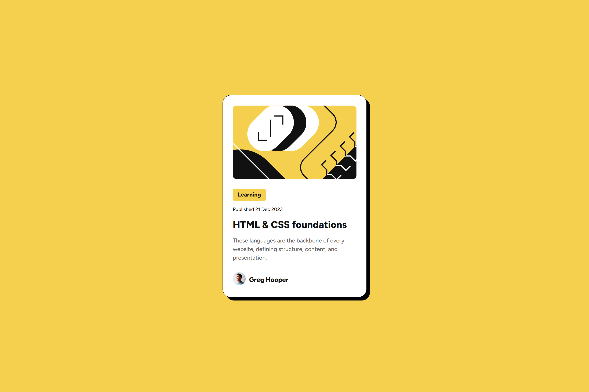

# Frontend Mentor - Blog preview card solution

This is a solution to the [Blog preview card challenge on Frontend Mentor](https://www.frontendmentor.io/challenges/blog-preview-card-ckPaj01IcS). Frontend Mentor challenges help you improve your coding skills by building realistic projects. 

## Table of contents

- [Overview](#overview)
  - [The challenge](#the-challenge)
  - [Screenshot](#screenshot)
  - [Links](#links)
- [My process](#my-process)
  - [Built with](#built-with)
  - [What I learned](#what-i-learned)
- [Author](#author)

## Overview

### The challenge

Users should be able to:

- See hover and focus states for all interactive elements on the page

### Screenshot

### Links

- Solution URL: [GitHub-Blog Preview Card](https://github.com/stefanteichert/blog-review-card)
- Live Site URL: [Vercel](https://blog-review-card-eight.vercel.app/)

## My process

### Built with

- HTML
- CSS 
- VS Code
- Figma Desktop App

### What I learned

In this project, I learned the importance of box-sizing and custom fonts for accurate layout:

- Box-sizing (border-box) ensures that padding and borders are included in an element’s width, making layouts predictable and easier to center, especially for cards.

- Custom fonts (@font-face) allow using local TTF files (Medium & ExtraBold), ensuring font-weights match the design exactly without relying on external sources.

## Author

- Frontend Mentor - [@Stefan](https://www.frontendmentor.io/profile/stefanteichert)
